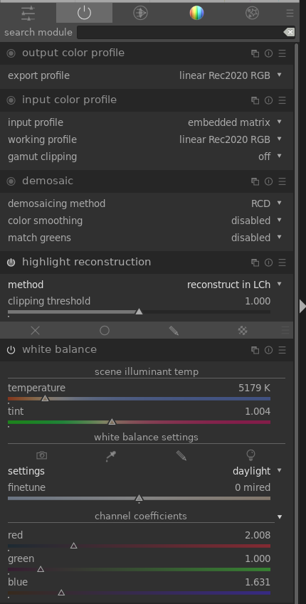
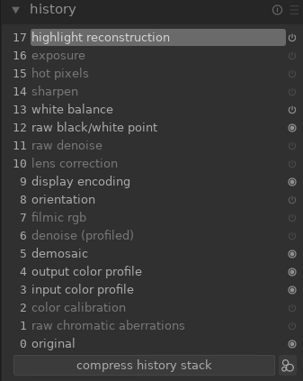

# Darktable Configuration
Here is what I did to get linear data out of `darktable-cli`, using Darktable 2.6.1.

## Settings
In the Darktable GUI, we disable all modules except for the following:  


Similar to RawTherapee, 
- we set whitebalance to Daylight
- Highlight reconstruction to "reconstruct in LCh" 
- demoisaic method to RCD
- input and output profile to Rec2020 (We convert from Rec.2020 to our target gamut using oiiotool)

## Create Config
To create a config file to use, you might think you could just export a `dtstyle` file from Darktable GUI and use that on the commandline to store the processing settings. But no.. The reality is much more painful than that.

The best solution I found was to open a test raw image, set the settings as described above, go to the history stack and click "Compress History":  


This simplifies the xmp file that is saved alongside the raw image that you have open.

Next you open the raw image and strip out some uncessary stuff:

Most importantly you must remove the entry in the processing stack that reads as follows:
```
   <rdf:li
      darktable:num="??"
      darktable:operation="rawprepare"
```
This contains raw image-specific raw decoding parameters. If it is there, you might be able to decode a dng file fine, but not a cr2. If it is not there, it seems to auto-calculate.

You can also remove entries like this at the top:
```
   exif:DateTimeOriginal="2021:04:26 18:02:13"
   xmp:Rating="1"
   xmpMM:DerivedFrom="2021-04-26-18h02m13.41s.dng"
   darktable:import_timestamp="1636075294"
   darktable:change_timestamp="1636075632"
   darktable:export_timestamp="-1"
   darktable:print_timestamp="-1"
```
As well as tags and creator metadata etc.

Once these edits are done you have a xmp config file you can use with darktable-cli. 

Important Note: If you need to change one setting, you need to re-do the whole process, because each module's settings are stored as a hash. So if one setting changes, they all change.

## Commandline Usage
The available Darktable-cli parameters look like this:
```
usage: darktable-cli [<input file or dir>] [<xmp file>] <output destination> [options] [--core <darktable options>]

options:
   --width <max width> default: 0 = full resolution
   --height <max height> default: 0 = full resolution
   --bpp <bpp>, unsupported
   --hq <0|1|false|true> default: true
   --upscale <0|1|false|true>, default: false
   --export_masks <0|1|false|true>, default: false
   --style <style name>
   --style-overwrite
   --apply-custom-presets <0|1|false|true>, default: true
                          disable for multiple instances
   --out-ext <extension>, default from output destination or '.jpg'
                          if specified, takes preference over output
   --import <file or dir> specify input file or dir, can be used'
                          multiple times instead of input file
   --icc-type <type> specify icc type, default to NONE
                     use --help icc-type for list of supported types
   --icc-file <file> specify icc filename, default to NONE
   --icc-intent <intent> specify icc intent, default to LAST
                     use --help icc-intent for list of supported intents
   --verbose
   --help,-h [option]
   --version
```
The settings I am using are like this:
`darktable-cli /path/to/raw_image.cr2 /path/to/profile.xmp /path/to/output_image.pfm --apply-custom-presets 0`

This processes raw_image.cr2 using profile.xmp out to a floating point pfm file (this is about 3x faster than openexr output). 

`--apply-custom-presets 0` bypasses loading of the darktable database, which is a lot slower and also problematic for commandline processing. You can't load more than one instance of darktable like this for multiprocessing, and it also fails if you have a gui instance open.

If you wanted to use database processing wht a dtstyle instead of an xmp file it is possible in theory. 

I went pretty far down this road before abandoning it.
`darktable-cli /path/to/raw_image.cr2 /path/to/profile.xmp /path/to/output_image.pfm --core --library ":memory:" --configdir /path/to/temp_config_dir`
I was doing a command something like this. `--core --library ":memory:"` [is necesssary](https://photo.stackexchange.com/questions/105969/darktable-cli-fails-because-of-locked-database-file) to avoid database locking. A custom temporary config directory with data.db file containing the desired dtstyle needs to be constructed for each instance of darktable that will run. This approach ended up being too much of a pain to code and configure.

What a pain in the butt.