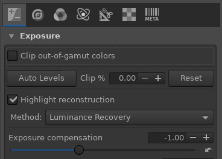
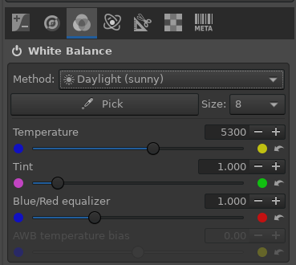
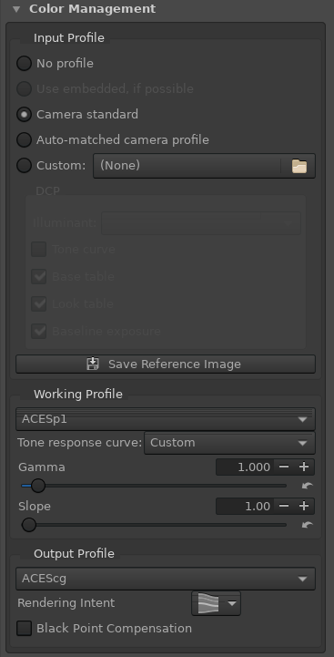
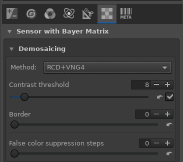
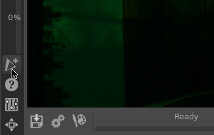
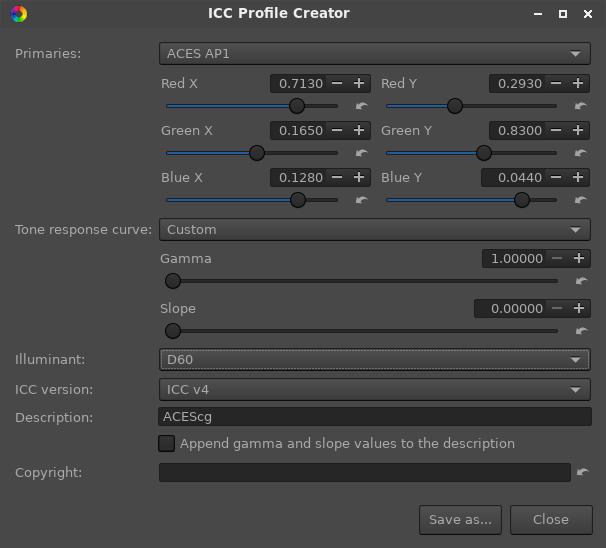

# RawTherapee Configuration
RawTherapee is an excellent open source raw processing software. There is a lot of extra functionality for "developing" raw images into a display-referred output. We don't care about these features though, since we want to render out a scene-referred linear exr image.

## Config
Here I'll describe the settings I'm using in the included default config file. All settings not pictured or mentioned are disabled or set to default values.
- **Exposure Tab**  
    
  In the exposure tab we enable highlight reconstruction. This "reconstructs" clipped highlights.  

  When a digital camera sensor is exposed an quantity of light beyond a certain threshold, it can no longer capture detail. With film this transition was a soft and pleasing "rolloff". With digital sensors, the result is a sudden and precise transition into no detail.  

  The raw file is captured with a bayer pattern from the raw photosites. When the raw file is decoded into an image, there are color transformations which must be performed for the image to look correct. In these color transformations, usually the green channel is lowered. With no highlight "reconstruction", this can result in magenta highlights.  

  There are a few different options of highlight reconstruction methods. They are all crap. Luminance recovery is simple and looks the best in most cases.  

  We also expose down the image by 1 stop. This is because RawTherapee will always clip the output image into a 0 to 1 range, even if you save out a 32bit float tif. The highlight reconstruction will boost highlight values above 1.0. Therefore we must expose down to preserve this reconstructed detail. 16 bit integer has plenty of precision to store this exposed down image. And we compensate for this exposure shift in the debayer code.

- **Colour Tab**  
    
  First we set the whitebalance. The default I've set here is the "Daylight" preset because it will be correct in most cases. You could set this to "Camera" in order to use the whitebalance setting programmed in the camera when you took the image. Or you could customize the whitebalance based on the images you are processing.  
    
  Next in the Colour Management module, we set up what colorspace the image will be output in. Input profile is the 3x3 matrix which will be used to convert the camera raw image into some known colorspace. It is like the "Input Device Transform" which you may be familiar with from the ACES system. Camera standard is a safe setting which will be good in most cases.  
  Working profile is just the colorspace that RawTherapee will use internally to perform it's processing.  
  Tone response curve is how the image will be encoded. "Gamma" of 1.0 will be linear. Slope is not used if gamma is 1.0, but it refers to the slope of a linear section in the output encoding. The default if no Tone response curve is selected is the sRGB piecewise image encoding function.  
  Unfortunately, there is [a massive posterization bug in RawTherapee 5.8](https://github.com/Beep6581/RawTherapee/issues/6378). We need to work around the bug by using a custom Output Profile (see below).  

- **Raw Tab**  
    
  In the Demoisaicing module in the raw tab, we configure how the raw bayer data is interpolated into an image. There are many different algorithms here to choose from. I have tested all of them extensively. RCD is the best option in my opinion (and one of the fastest to process). RCD+VNG4 Demoisaics the image twice, and then blends them together. Areas of high detail uses the sharper RCD, flatter areas of lower detail uses VNG4, which provides a smoother image with reduced "maze" or "stair-stepping" artifacts in noisy areas.

# Create and Install a Custom Output ICC Profile
To use the included default RawTherapee config you need to install a custom output icc profile named `ACEScg.icc`. 
1. The easiest is to download [this ICC profile](https://github.com/ellelstone/elles_icc_profiles/blob/master/profiles/ACEScg-elle-V4-g10.icc) from [Elle Stone](https://ninedegreesbelow.com)'s [icc profiles github repo](https://github.com/ellelstone/elles_icc_profiles).
2. You can also use the included ICC Profile Creator to create your own.  
    
  First click on the ICC Profile Creator button in the lower left of the interface.  
    
  Set up the ICC profile to the desired primaries, tone response curve, and whitepoint. The above settings will output ACEScg.  
  Save the profile as `ACEScg.icc` 
3. Next we need to install this icc profile in a place where RawTherapee can see it. Here are the default paths for different systems:  
   1. Windows: `<rt-install-folder>\iccprofiles\output`
   2. Linux (BUILD_BUNDLE=OFF): `/usr/share/rawtherapee/iccprofiles/output`
   3. Linux (BUILD_BUNDLE=ON): `<rt-install-folder>/iccprofiles/output/`
   4. Mac: `/Library/ColorSync/Profiles/Displays` (untested)  

More info can be found at these links:
- https://rawpedia.rawtherapee.com/Color_Management#Adding_Custom_Working_Profiles
- https://rawpedia.rawtherapee.com/ICC_Profile_Creator
- https://github.com/Beep6581/RawTherapee/issues/6378

